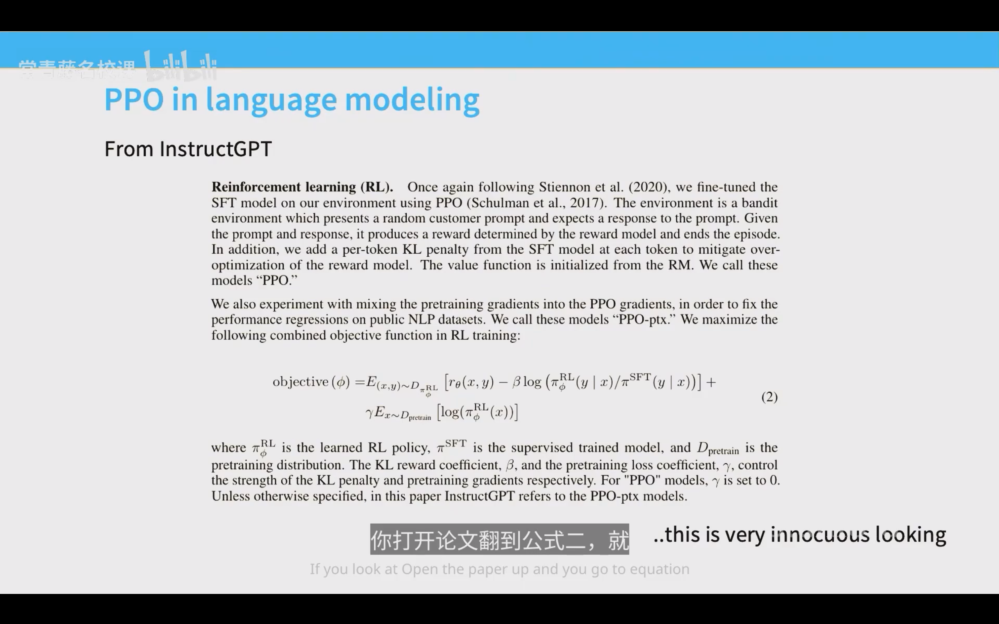
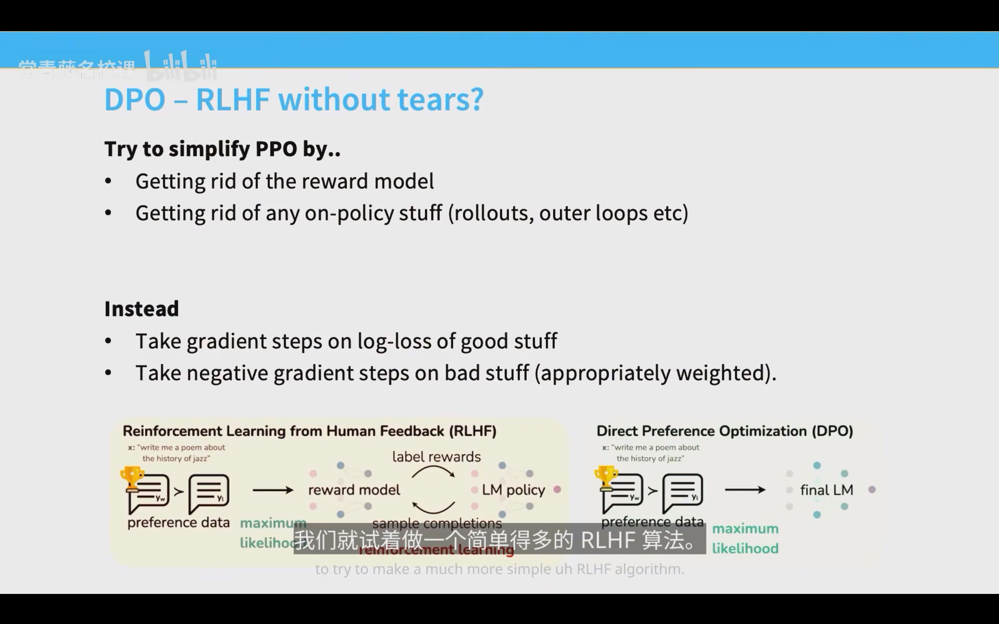
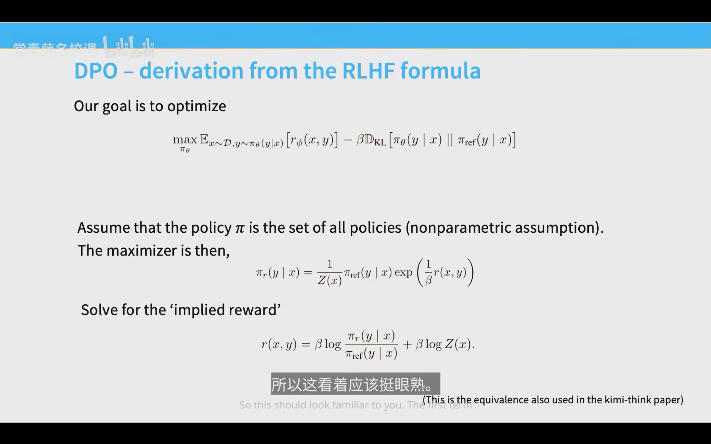
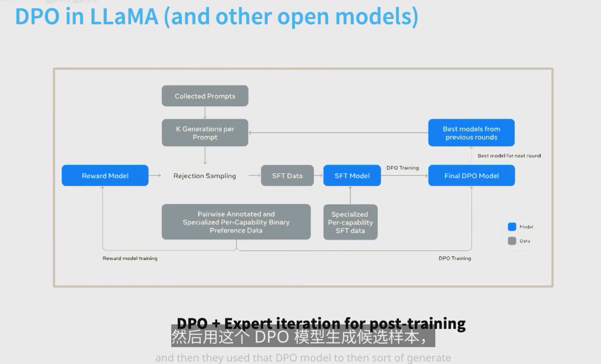
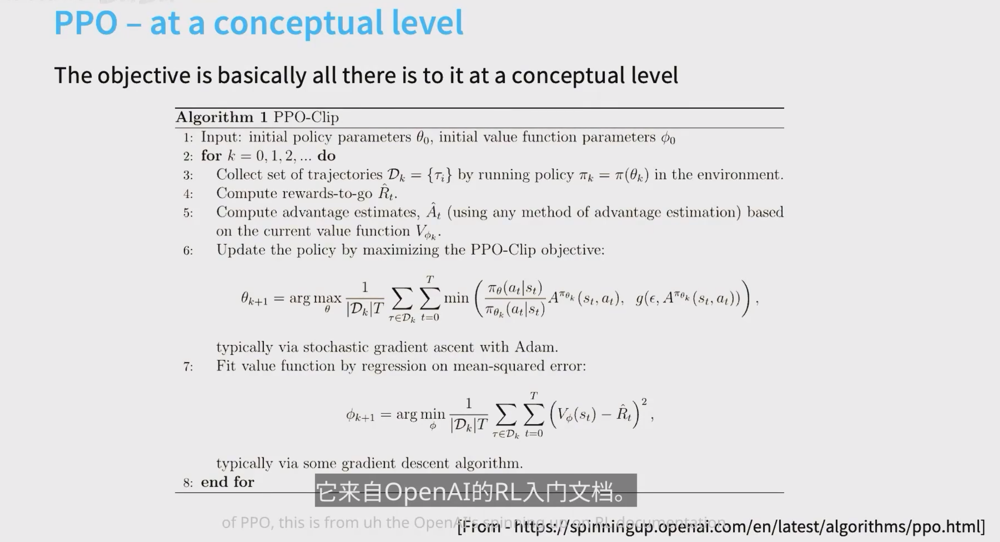
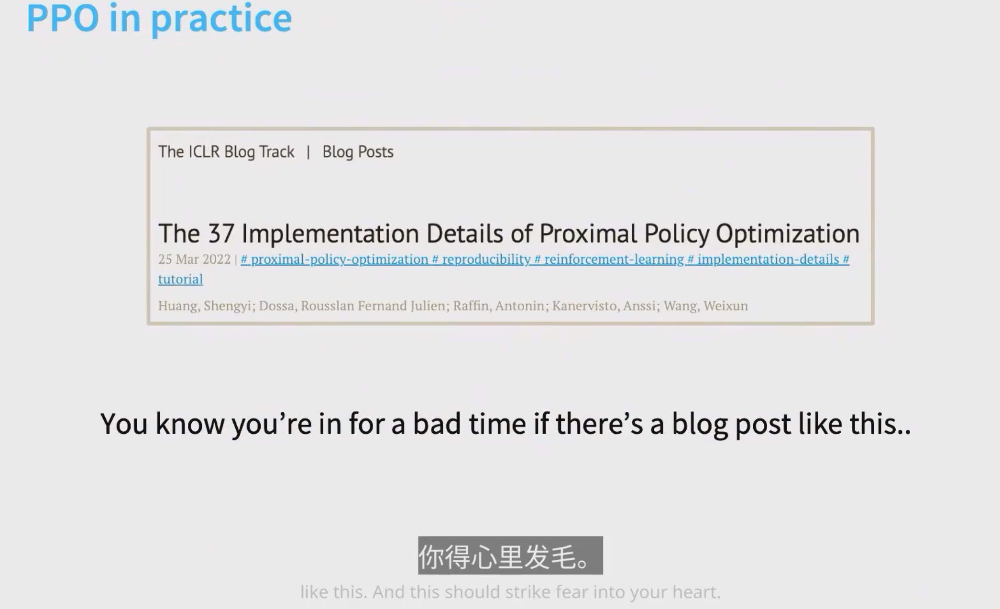
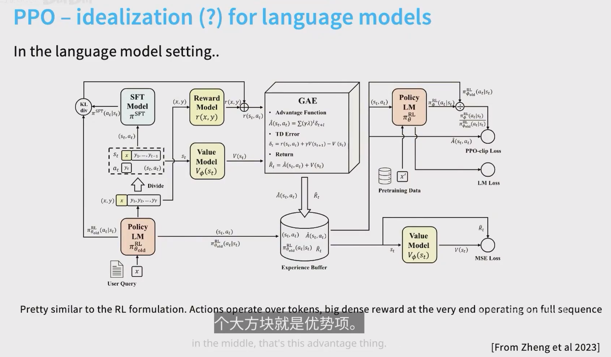
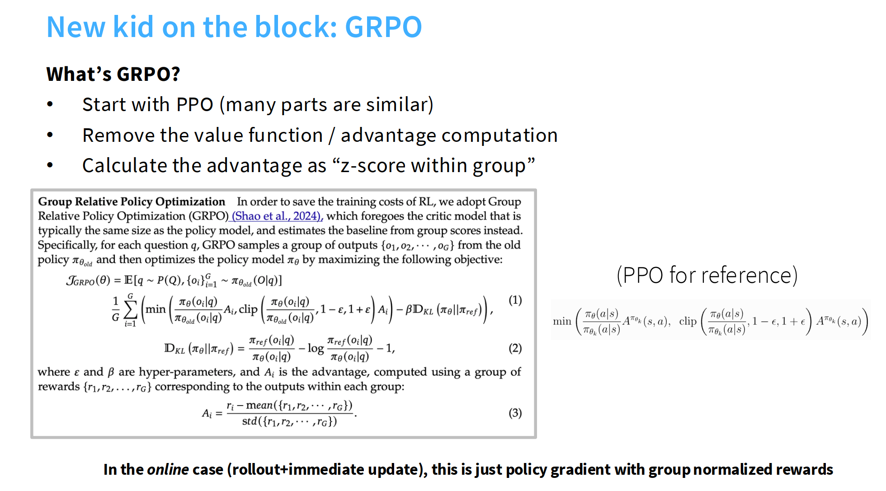
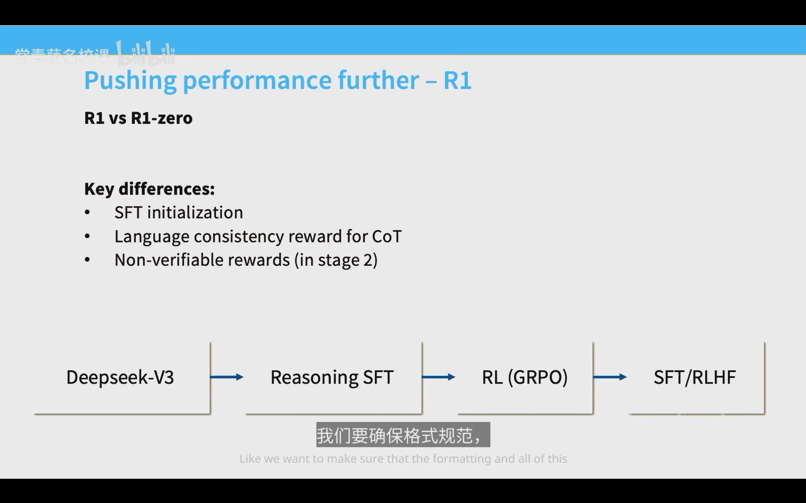

2026年7月7日

这里面有个 KL 散度项，为了保证模型和预训练模型不能差太大。

采样的成本很高，推理很复杂，很难搞。但训练则是一个比较简单的事情，所以我们想只 roll out 一次，然后多次训练。

所以我们有了 TRPO 和 PPO

前者有一个约束条件，后者认为这个约束条件不太好，所以搞了一个启发式的裁剪策略。

然后我们就想，能不能连 PPO 都不用？但是如果连 PPO 都不用，我们就会搞出来一些像 SFT 的东西。最后，我们也确实搞出来了跟 SFT 一样的东西，也就是我们的 DPO。

他说了很诡异的话，非常诡异。

他说，首先这个 DPO 是在好的方向上走若干个正梯度步，然后在不好的方向上走负梯度步。而且我们要进行缩放，在某种意义上，步长的缩放取决于我的隐含奖励模型错得有多离谱。

比方说：
1. 如果我们给那个赢的例子打了很高的奖励，我们就走一小步。
2. 如果我们大错特错，觉得这两个概率差不多相等，在那种情况下，我实际上会迈出大得多的一步。

所以，根据概率上的差异，我们会在这种差分对数概率目标上，采取更大或更小的步长。

有没有一种方法可以稳定的优化，不用担心过度优化？

这也代表着，我们只要堆算力，这个模型就能不停地变好。这是我们马上遇到的 RLVR。

根本上用来解决可验证的难题。

but

然后我们开始“诋毁”一下 PPO 吧。

首先，这个 37 个 implementation details 就非常抽象，对吧？

然后还有什么问题呢？就是它非常挑剔。对于一个从零开始的研究者而言，这东西太过挑剔了，而且很复杂。

而且我们需要一个奖励模型、一个价值模型，这个价值模型跟原模型是一样大的，你 double 了你需要的这个算力，对吧？

然后我们诋毁一下 DPO。DPO 只适用于某种特定的数据，叫做 Bradley-Terry 型的配对成对的反馈。

然后我们来看到今天的主角：GRPO。

GRPO 是什么呢？是我们的 DeepSeek（DS）老师在论文里面提到的。他说这个 PPO 挺好的，但我们想改一下它。他们把一个最烦的地方——也就是我们的奖励函数和价值函数部分，做了一些 biu biu biu 的更改，我们会把这个更改抓过来。

这里有一些模糊的描述。比如：价值函数是一个基线（baseline），通过减掉价值函数可以降低我们的方差，这个我也能理解。

但是，价值函数又是一个复杂的神经网络，它会让训练变得不稳定。如果我们不要它、把它去掉，但同时又需要优势估计（advantage estimation）该怎么办？如果不用它，只用普通的 REINFORCE 算法，方差又会变得很高。

我们要做的是在组内把价值算成一个 Z 分数。

我在想，我们是否已经不需要去知道一些东西“是什么”了。

比如，我觉得我甚至都不需要知道 KL 散度的定义是什么，我只需要知道它的作用是保持我们的原模型和现模型不要太远，而数学定义根本不重要。

这也是这个时代理论的悲哀，我想。

然后后来我在反思，我所学习的理论，事实上是不是为我的时间找一种沉重的感觉呢？

毕竟，对着那些公式看，和对着那些实验结果看而言，能具有更好可解释性的公式，是可以让人的时间有更加沉重的感觉吧，我想。

我有时候喜欢将一些理论生活化。

比如我在和 AI 适配的过程中，就能感受到为什么 rollout 是个很烦人的事情：你需要一等不知道多少分钟，甚至第二天爬起来，看你的 prompt 到底 set a goal（设定目标）之后，它给你给出了一个怎样的结果。这确实是挺烦人的一件事情。

但我想，习惯了之后也好。将这些比较高深的问题生活化之后，或许能为我们提供一些新的解决视角。

我该写写影评，或者写一下非虚构文学了。

先写影评吧，《花束般的恋爱》。

那么为了呈现一个完整的 trajectory，我们需要对它有个先验信息，然后再一步步更新我们的先验。

那我们的先验信息是什么呢？

首先，这是我上大学看的第一部电影（我有点忘了当时为什么会看这部电影）。大概是在某节思政史纲课上，我非常无聊，打开了电脑和 B 站，然后加了个架子，把这部电影看完了。

它很符合我对爱情的幻想。毕竟我是个没谈过恋爱的“母单”，但凡我谈过一段恋爱，可能都不会有这样的幻想——就这种“你喜欢我，我喜欢你，我们都是小众b”的展开，似乎非常符合我对恋爱的幻想。然后，它比较符合我的悲观主义色彩。

如果要去回忆情节的话，无非就是两个人刚开始遇到，然后开始谈恋爱之类的。

其中有一些照进现实的细节：
他们第一次亲吻的地方，是因为一个红绿灯。那个红绿灯需要人手动按一下才能亮，北京其实也有这种红绿灯，还挺好玩的。

后来他们在分开的时候（本来都准备要结婚了，那个男生和女生本来决定好要分开），男生反悔了。他认为结婚就会好起来，拿出了那种——怎么形容呢？老一辈的、或者说“老登”的那种态度吧。

然后女生拒绝了，两个人就分开了。分开的时候还说：“其实你当时那点我不喜欢，我当时那点你也不喜欢”之类的。

我很喜欢那个细节，可能我是在追求一种戏剧感吧。当然，这也可以在一定程度上被认为是一个没谈过恋爱的人对爱情的美好幻想。

不过我觉得，如果第一次恋爱是这样的话，是一件很不错的事情。

那么，第二点要谈的应该就是电影中呈现对于爱情的态度。是的。

这论文写得……我有点麻了。

我感觉我的思考过于浅薄，或者说过于武断，没有深入到电影本身去。我其实只是找到了电影在我内心的一个投射，然后把那个投射固定下来。

孤独选择怪癖，还是怪癖本身选择了孤独？

是怪癖引发了自恋，还是为了自恋才生出了怪癖？

无归属

回头看，依旧是Bye, Miss Girl.

除以总长度会鼓励模型在解不出题时一直废话。

那么除以标准差是什么？其实是在针对一些标准差很小的时候的情况。那么什么时候标准差会很小呢？

题特别简单和题特别难的情况，所以除以标准差相当于放大了难题和简单题在训练中的权重，这不是什么好事。

DeepSeek R1 放弃了过程监督，改用只用果汁（结果）监督，在他们的数学中。

