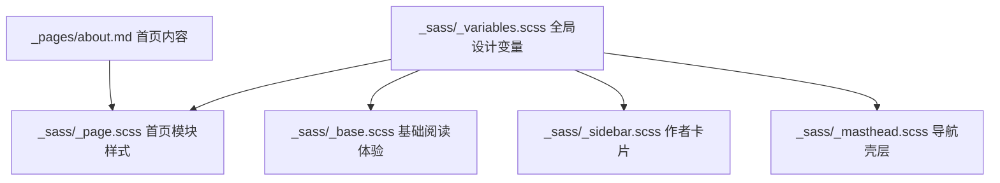

# 技术设计: 首页中文博客化改版

## 技术方案
### 核心技术
- Jekyll 页面内容组织
- Sass 变量与分文件样式体系

### 实现要点
- 在 `_pages/about.md` 中构建首页欢迎区、内容入口卡片与更新说明模块。
- 在 `_sass/_variables.scss` 中重设更适合中文博客的颜色、字体与圆角阴影基础变量。
- 在 `_sass/_page.scss`、`_sass/_sidebar.scss`、`_sass/_masthead.scss`、`_sass/_base.scss` 中统一首页与公共壳层次。
- 在 `_config.yml` 与 `author-profile.html` 中补少量中文化文案。

## 架构设计

## 安全与性能
- **安全:** 本次改动只涉及静态页面和样式，不引入第三方脚本或敏感信息。
- **性能:** 复用现有主题编译链，不新增图片和大型前端依赖。

## 测试与部署
- **测试:** 执行 `bundle exec jekyll build` 验证页面和 SCSS 能正常构建。
- **部署:** 构建通过后即可按现有静态站点流程发布。
