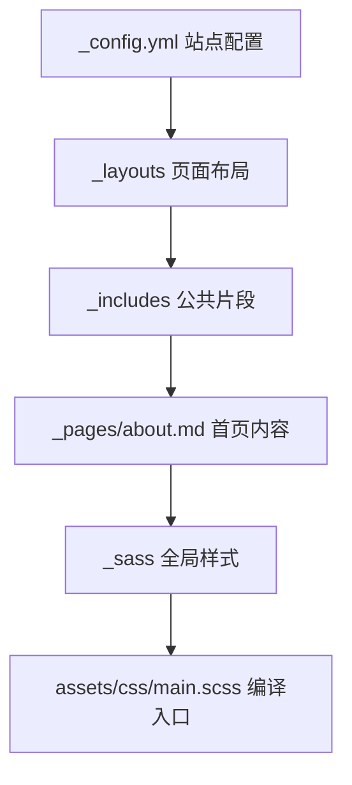
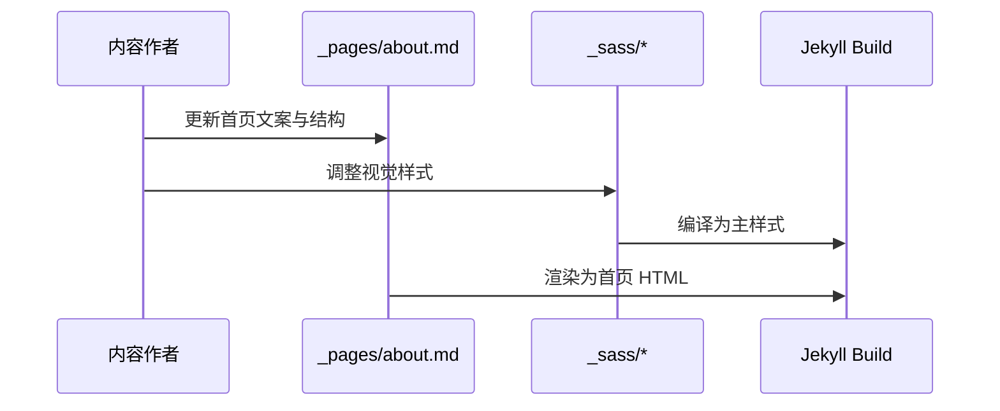

# 架构设计

## 总体架构

```mermaid
flowchart TD
    A[_config.yml 站点配置] --> B[_layouts 页面布局]
    B --> C[_includes 公共片段]
    C --> D[_pages/about.md 首页内容]
    D --> E[_sass 全局样式]
    E --> F[assets/css/main.scss 编译入口]
```

## 技术栈
- **站点:** Jekyll
- **前端:** HTML + Liquid + Sass
- **部署模式:** 静态站点部署

## 核心流程

```mermaid
sequenceDiagram
    participant Author as 内容作者
    participant Page as _pages/about.md
    participant Sass as _sass/*
    participant Build as Jekyll Build
    Author->>Page: 更新首页文案与结构
    Author->>Sass: 调整视觉样式
    Sass->>Build: 编译为主样式
    Page->>Build: 渲染为首页 HTML
```

## 重大架构决策
当前项目暂无需要单独归档的重大架构 ADR，页面改版方案记录在历史方案包中。
